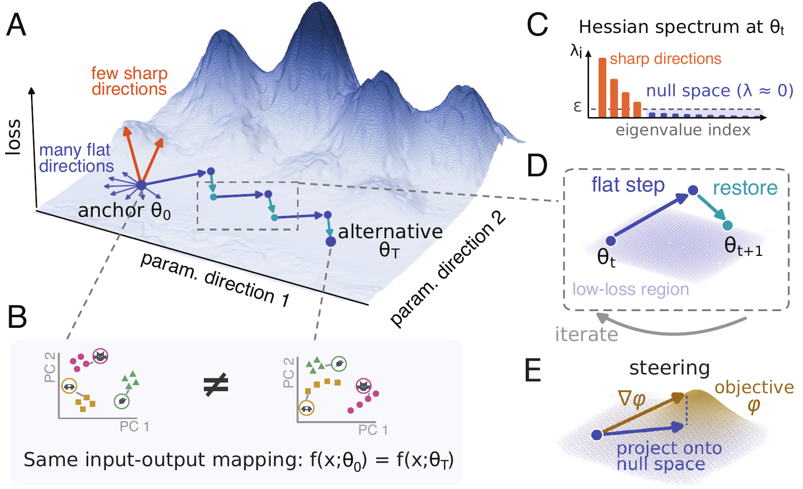

# Hessian Null Space Continuation (HNC)

Code for **Traversing the solution space of neural networks with Hessian Null Space Continuation**<br>
(Ann Huang, Mitchell Ostrow, Zhouyang Lu, Will Redman*, Leo Kozachkov*, Kanaka Rajan*).

HNC moves a trained network through weight space while keeping its input-output mapping fixed. Each
iteration takes a small step inside the null space of the Hessian of a function-preserving loss, then
a few gradient steps that restore the function. The walk can be undirected, or steered toward networks
with chosen properties, for example representations or dynamics that differ as much as possible from
the network it started from.

<p align="center">
  
</p>

<br>

## Installation

```bash
git clone https://github.com/Ann-Huang-0/hessian-null-space-continuation.git && cd hessian-null-space-continuation
pip install -e .                  # torch, numpy, scipy, pyyaml, POT
pip install -e ".[notebook]"      # matplotlib, scikit-learn, jupyter, for the Fig. 2 notebook
```

Recomputing DSA distances (not needed for the notebook) also requires the
[DSA package](https://github.com/mitchellostrow/DSA): `pip install git+https://github.com/mitchellostrow/DSA`.

<br>

## The method in code

| Appendix pseudocode | Code |
|---|---|
| Algorithm 1, HNC | `hnc.walk` (`hnc/walk.py`) |
| Algorithm 2, NullSpace | `hnc.curvature.null_space`: dense eigendecomposition for small models, LOBPCG otherwise |
| Algorithm 3, StepDir | `hnc.RandomHeading` and `hnc.Flattest` (undirected), `hnc.Steer` (soft projection, solved by conjugate gradients) |
| Gauss-Newton operator G = J^T J | `hnc.curvature.gauss_newton` |
| Steering objectives | `hnc.potentials`: `cka_distance`, `dsa_distance`, `action_kl`, `action_mse` |
| Reinforcement learning | `hnc.rl.RewardPreserving`, `hnc.rl.policy_preserving` |

A walk operates on a `Problem`: the anchor's weights as one flat vector, the loss to keep below the
ceiling, the curvature operator whose near-null space counts as flat, and, for a steered walk, a
potential to maximize. For any PyTorch model:

```python
import hnc

theta0, f = hnc.functional(model)              # flat weights, and f(theta, x) = model(x) at weights theta
outputs = lambda th: f(th, x)[0].reshape(-1)    # here model(x) returns (outputs, hidden features)
features = lambda th: f(th, x)[1]

# preserve the outputs on the probe set x (Eq. 1) and steer the features away from the anchor's
problem = hnc.function_matching(outputs, theta0, potential=hnc.potentials.cka_distance(features, theta0))
result = hnc.walk(problem, hnc.Steer(mu_rel=1e-5, cg_iters=100), n_steps=200, tau=1e-3, eta=0.03, eta_min=5e-4)
```

`result` holds the loss at every step, the weights at the saved steps (`snapshots`), and any metrics
passed to `walk`. To preserve the task loss instead of the outputs, build the problem directly:
`hnc.Problem(theta0, task_loss, hnc.curvature.gauss_newton(outputs), potential)`. For an undirected walk,
pass `hnc.RandomHeading(mu_rel=1e-3, method='lobpcg', k=64)` as the direction; any differentiable function
of the weights can serve as a potential.

<br>

## Reproducing Fig. 2

```bash
cd notebooks && jupyter notebook fig2.ipynb
```

The notebook draws every panel of Fig. 2 from `data/fig2`, on a CPU in a few minutes. `data/fig2/walks`
holds the walks shown in the paper: from each of five trained anchors, three undirected, three CKA-steered
and three DSA-steered walks and one walk along the flattest direction, plus three walks from anchor 0
steered away from an earlier endpoint (panel F). Each file stores the task loss at every step and the
weights at the checkpoints. `data/fig2/dsa_distances.npz` holds the DSA distances of panel B, which take
hours of fitting.

To run the walks yourself:

```bash
python scripts/run_walk.py configs/fig2/cka.yaml --anchor 0 --seed 0 --out runs/fig2/a0_cka_k0.pt
bash scripts/run_fig2_walks.sh runs/fig2                                   # all 50 walks
python scripts/fig2_dsa.py runs/fig2 --out runs/fig2/dsa_distances.npz --workers 8
```

and set `WALKS` and `DSA` in the notebook to `runs/fig2`. On one GPU an undirected walk takes about
15 minutes, a CKA-steered walk 40 minutes, and a DSA-steered walk about an hour; an interrupted walk
continues from its checkpoint when the same command is run again. The configs hold the settings of the
paper (Appendix, walk hyperparameters) and preserve the function-matching loss of Eq. 1. 

<br>

## Reinforcement learning

`preserve: reward` keeps the return, through an importance-sampled surrogate on a buffer that is
re-collected along the walk, and steers the behavior away from the anchor's. `preserve: policy` keeps
the policy's actions on a fixed set of states and steers its hidden representation.

**Boat race** (AI Safety Gridworlds; Fig. 4D-E). The environment is included, and a walk runs on a CPU in
about 10 minutes:

```bash
python scripts/run_walk.py configs/rl/boat_reward.yaml --anchor 5 --out runs/rl/boat_reward_5.pt
python scripts/run_walk.py configs/rl/boat_policy.yaml --anchor 0 --out runs/rl/boat_policy_0.pt
```

The walk logs the action divergence from the anchor, the proxy return and the true return, which the
agent never sees; a reward-hacking policy keeps the proxy return while its true return falls to zero.

**Plume tracking** (Fig. 4A-C). Needs the simulator of Singh et al. (2023) and its data; see the
instructions at the top of `hnc/tasks/plume.py`. Then

```bash
python scripts/run_walk.py configs/rl/plume_reward.yaml --out runs/rl/plume_reward.pt
```

<br>

## Configs

A config names a task module in `hnc/tasks` and its settings, a `direction` block, and a `walk` block
whose keys are the arguments of `hnc.walk`:

| Key | Meaning |
|---|---|
| `preserve` | `task` or `function` (supervised); `reward` or `policy` (RL) |
| `curvature` | `gauss_newton` or `hessian`: the operator whose flat directions are followed |
| `direction.type` | `random`, `flattest` (undirected) or `steer` |
| `direction.mu_rel` | relative flatness threshold, and the soft-projection damping of steered walks |
| `direction.objective` | steering potential of the flip-flop walks: `cka` or `dsa`. RL walks steer the action divergence (`preserve: reward`) or the hidden-layer CKA distance (`preserve: policy`) |
| `walk.tau` | loss ceiling; a step is accepted only if the loss stays below it |
| `walk.eta`, `eta_min`, `eta_max`, `grow` | null-space step size: halved on rejection, multiplied by `grow` after an accepted step |
| `walk.restore_steps` | function-restoring gradient steps after each null-space step |
| `walk.relinearize_every` | recompute the null space of an undirected walk every this many steps |
| `walk.refresh_every` | re-collect the RL buffer every this many steps |
| `walk.save`, `metrics_every` | which weights to keep, and how often to evaluate the metrics |

<br>

## Repository layout

```
hnc/            the method: walk, directions, curvature, potentials, metrics, rl
hnc/tasks/      the systems of the paper: 3-bit flip-flop RNN, boat race, plume tracking
configs/        walk settings of the paper
scripts/        run_walk.py, the Fig. 2 walks and DSA distances, anchor training
notebooks/      fig2.ipynb and its plot style
data/anchors/   trained networks: 50 flip-flop RNNs (seeds 0-4 are the anchors), 10 boat race and 3 plume policies
data/fig2/      the walks and DSA distances behind Fig. 2 (task loss preserved)
assets/         README figure
```

<br>

## Citation

```bibtex
@article{huang2026hnc,
  title  = {Traversing the solution space of neural networks with Hessian Null Space Continuation},
  author = {Huang, Ann and Ostrow, Mitchell and Lu, Zhouyang and Redman, Will and Kozachkov, Leo and Rajan, Kanaka},
  year   = {2026}
}
```

<br>

## License

MIT (see `LICENSE`).
